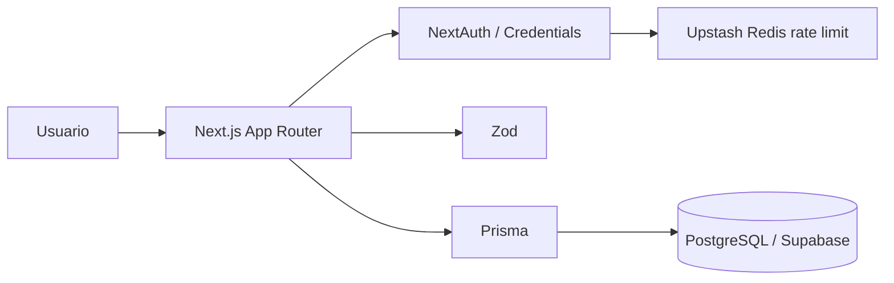

# Arquitectura - Fase 1

La UI pública y privada vive en Next.js. Todas las operaciones sensibles se revalidan en servidor. Prisma centraliza el acceso a datos y PostgreSQL persiste usuarios, cursos e inscripciones.
