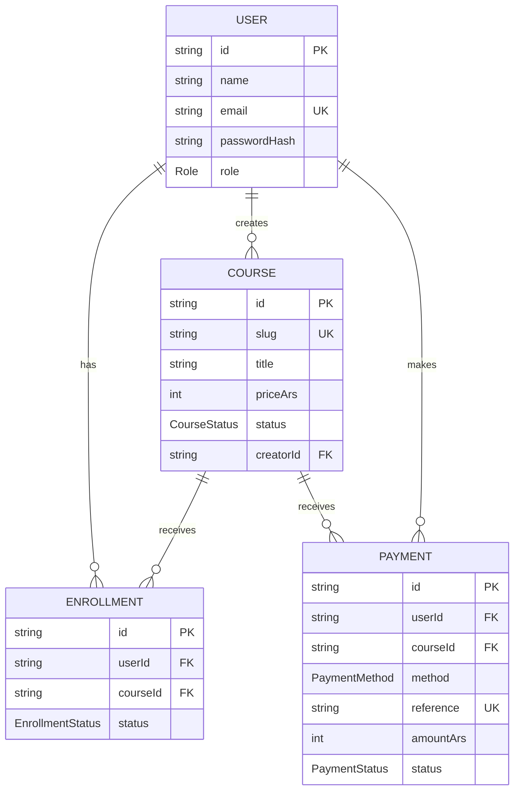

# DER - Fase 1

```mermaid
erDiagram
  USER ||--o{ ENROLLMENT : has
  COURSE ||--o{ ENROLLMENT : receives
  USER ||--o{ COURSE : creates

  USER {
    string id PK
    string name
    string email UK
    string passwordHash
    Role role
  }
  COURSE {
    string id PK
    string slug UK
    string title
    int priceArs
    CourseStatus status
    string creatorId FK
  }
  ENROLLMENT {
    string id PK
    string userId FK
    string courseId FK
    EnrollmentStatus status
  }
  PAYMENT {
    string id PK
    string userId FK
    string courseId FK
    PaymentMethod method
    string reference UK
    int amountArs
    PaymentStatus status
  }
  USER ||--o{ PAYMENT : makes
  COURSE ||--o{ PAYMENT : receives
```
